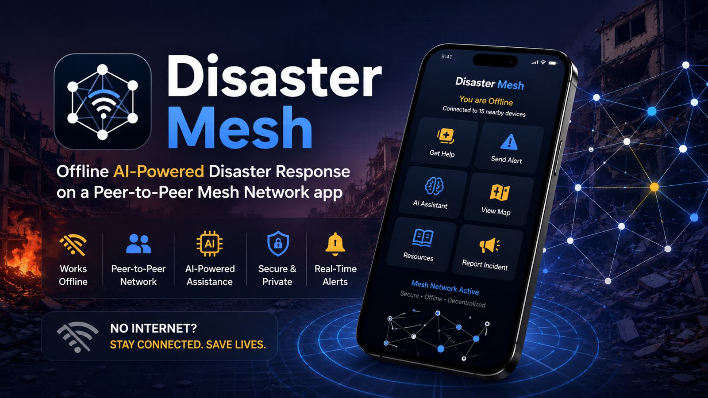

# DisasterMesh



> *3 AM. Earthquake. Cell towers down within 40 km. A volunteer has no idea where to go. An authority has no idea what's happening. A civilian is trapped and has no idea if anyone is coming.*
>
> *Every coordination tool they trained for needs the internet.*

We built one that doesn't.

---

DisasterMesh is an Android app that lets civilians, volunteers, and authority responders coordinate during a disaster — over a peer-to-peer mesh using just Bluetooth and Wi-Fi Direct. No internet. No servers. Phones talk directly to each other.

Gemma 4 runs entirely on-device to triage incoming distress signals, analyse zones, and help authorities make faster decisions — all offline.

---

## How It Works

### Three Roles, One Mesh

| Role | Capabilities |
|------|-------------|
| **Civilian** | Raise distress signals, track ticket progress |
| **Volunteer** | Receive assignments, accept/reject, update status in the field |
| **Authority** | Zone command, triage, assignment, inventory, mesh broadcasts |

### Mesh Layer

Built on **Google Nearby Connections** (BLE advertising + Wi-Fi Direct transfer). No router required. Range extends with every device added to the mesh.

A custom **GossipRouter** sits on top:
- Every packet carries `ttl` and `hopCount` — dropped when TTL expires
- Deduplication by packet ID prevents loops
- **Store-and-forward** brings a rejoining device to full sync within 10 seconds of sending a HELLO
- **Last-write-wins** on `updatedAt` timestamp for conflict resolution

Packet types: `SIGNAL`, `SIGNAL_UPDATE`, `TICKET_ASSIGNMENT`, `INVENTORY_UPDATE`, `CHAT`, `DM`, `CRITICAL_POI_UPDATE`, `SAFE_ZONE_UPDATE`

### Ticket Lifecycle

```
NEW → ACKNOWLEDGED → ASSIGNED → ACCEPTED → IN_PROGRESS → RESOLVED
                              → REJECTED / CANCELLED / FAILED
```

Assignment carries volunteer IDs, names, task instructions, and inventory allocation. Inventory is reserved on ASSIGNED and atomically refunded on REJECTED, CANCELLED, or FAILED.

### Persistence

Room database (v7) with guarded chained migrations. All UI is driven by Room `Flow` — no polling, no manual refresh. When a ticket resolves on one device and propagates across the mesh, every subscribed screen updates automatically.

---

## Gemma 4 On-Device AI

**No remote API. No cloud fallback. On-device only.**

`GemmaClient` wraps LiteRT-LM (Google AI Edge) running **Gemma 4 E2B** (~2.6 GB). The model is downloaded once over Wi-Fi before deployment and cached on-device. All inference runs locally across all AI features.

### Live

**Signal Triage** — Every incoming distress signal is automatically classified by Gemma 4 before any human reviews it. Output: category (`MEDICAL`, `RESCUE`, `RESOURCE`, `SAFETY`, `INFO`), priority (`CRITICAL`, `HIGH`, `NORMAL`, `LOW`), AI summary, and estimated people affected. Classified metadata propagates with the signal across the mesh.

**Zone Analysis** — Authorities trigger analysis on any geographic cluster. Gemma 4 receives all zone signals — categories, priorities, people counts, statuses — and produces a commander-framed SITREP: most urgent signals, resource gaps, and recommended action sequence.

### Planned

**AI Ticket Resolution** — Gemma 4 reasons over an unassigned signal alongside connected volunteers and their current workloads, returning a structured assignment recommendation. Authority reviews and confirms. Gemma advises; humans command.

**Civilian Emotional Support** — Signal-specific, calming, actionable responses to civilians waiting for help. Entirely on-device. No words leave the phone.

**Conversational Briefing** — Natural language queries over live mesh state: *"Which zone has the most critical unattended signals?"* Gemma 4 synthesizes answers from the local database snapshot.

---

## Results

Tested across three Android devices, zero internet:

| Metric | Result |
|--------|--------|
| Signal propagation (3 hops) | < 2 seconds |
| Mesh sync on device rejoin | < 10 seconds |
| Zone Analysis generation | 8–15 s (mid-range Snapdragon) |
| Inventory accuracy (50 cycles) | Zero phantom stock |
| Signal triage accuracy | ~90% on test signals |

---

## Tech Stack

| Layer | Technology |
|-------|-----------|
| Language | Kotlin |
| UI | Fragments, ViewBinding, Material 3 |
| Async | Coroutines + Flow |
| Database | Room v7 (SQLite) |
| Mesh transport | Google Nearby Connections 19.1.0 |
| On-device AI | LiteRT-LM 0.11.0 — Gemma 4 E2B |
| Min Android | API 24 (Android 7.0) |

---

## Setup & Build

### Prerequisites

- Android Studio Hedgehog or later
- JDK 17
- Android device running API 24+ (physical device required — Nearby Connections does not work on emulators)

### Build

```bash
git clone https://github.com/mahirabidi12/PiedPiper.git
cd PiedPiper/android
./gradlew assembleDebug
```

### Model Download

Gemma 4 E2B (~2.6 GB) is not bundled in the APK. On first launch, open the **AI** tab and tap **Download Model**. Download once on Wi-Fi before field deployment.

The model is stored at:
```
/sdcard/Android/data/com.disastermesh.app/files/models/gemma.litertlm
```

### Permissions Required

- `BLUETOOTH_ADVERTISE`, `BLUETOOTH_SCAN`, `BLUETOOTH_CONNECT` (Android 12+)
- `ACCESS_FINE_LOCATION` (required by Nearby Connections)
- `NEARBY_WIFI_DEVICES` (Android 12+)
- `RECORD_AUDIO` (voice-to-text in chat)
- `POST_NOTIFICATIONS`

---

## Architecture

```
DisasterMeshApp
 └── MainActivity
      ├── MeshService (foreground service)
      │    ├── MeshManager       — Google Nearby Connections
      │    └── GossipRouter      — dedup, TTL, relay, store-and-forward
      ├── AppViewModel           — shared state flows
      └── Fragments
           ├── CivilianHomeFragment
           ├── VolunteerHomeFragment
           ├── AuthorityHomeFragment   — zone clusters, assignment, broadcast
           ├── ZoneDetailFragment      — per-zone signals + Gemma analysis
           ├── AiChatFragment          — on-device AI assistant
           ├── ChatRoomFragment        — mesh chat with TTS/STT
           ├── InventoryFragment
           └── NodeFragment            — peer list, mesh status
```

---

## File Structure

```
android/app/src/main/java/com/disastermesh/app/
│
├── DisasterMeshApp.kt               # Application entry point
│
├── mesh/                            # P2P networking layer
│   ├── MeshService.kt               # Foreground service, keeps mesh alive
│   ├── MeshManager.kt               # Google Nearby Connections wrapper
│   ├── GossipRouter.kt              # Gossip protocol — dedup, TTL, relay, store-and-forward
│   └── MeshPacket.kt                # JSON wire envelope for all packets
│
├── ai/                              # On-device Gemma 4 integration
│   ├── GemmaClient.kt               # Only class that touches the model
│   ├── SignalProcessor.kt           # Auto-classification pipeline
│   ├── SignalClassifier.kt          # Category + priority extraction
│   ├── PromptTemplates.kt           # All prompts in one place
│   ├── SituationalBriefingEngine.kt # SITREP generation
│   ├── KnowledgeBaseRetriever.kt    # Keyword RAG over bundled emergency KB
│   ├── ModelDownloader.kt           # In-app download with resume support
│   ├── LanguagePromptWrapper.kt     # Multi-language prompt support
│   └── AiHistory.kt                 # Conversation tracking
│
├── db/                              # Room database (v7)
│   ├── AppDatabase.kt               # 12 entities, 12 DAOs, chained migrations
│   ├── dao/                         # Data access objects
│   │   ├── SignalDao.kt
│   │   ├── ChatMessageDao.kt
│   │   ├── PeerDao.kt
│   │   ├── DirectMessageDao.kt
│   │   ├── InventoryDao.kt
│   │   ├── AiSessionDao.kt
│   │   ├── AiMessageDao.kt
│   │   ├── SeenPacketDao.kt         # Gossip deduplication
│   │   ├── AuditLogDao.kt
│   │   ├── CriticalPoiDao.kt
│   │   └── SafeZoneDao.kt
│   └── entities/                    # Room entity classes (mirrors dao/ structure)
│
├── model/                           # Domain models
│   ├── Signal.kt                    # + SignalCategory, SignalPriority, SignalStatus enums
│   ├── ChatMessage.kt               # + ChatRooms definitions
│   ├── Peer.kt
│   ├── Role.kt                      # CIVILIAN | VOLUNTEER | AUTHORITY
│   ├── InventoryItem.kt
│   └── AreaCluster.kt               # Geographic signal cluster
│
├── ui/
│   ├── MainActivity.kt
│   ├── AppViewModel.kt              # Activity-scoped shared state flows
│   ├── home/
│   │   ├── CivilianHomeFragment.kt
│   │   ├── VolunteerHomeFragment.kt
│   │   └── AuthorityHomeFragment.kt
│   ├── zone/
│   │   ├── ZoneDetailFragment.kt    # Per-zone signals + Gemma analysis trigger
│   │   └── ZoneAnalysisBottomSheet.kt
│   ├── comms/
│   │   ├── ChatFragment.kt
│   │   ├── ChatRoomFragment.kt      # Mesh chat with TTS + STT
│   │   └── DirectConversationFragment.kt
│   ├── ai/
│   │   ├── AiChatFragment.kt
│   │   ├── AiChatViewModel.kt
│   │   └── LanguageBottomSheet.kt
│   ├── sheet/                       # Bottom sheets
│   │   ├── ComposeSignalBottomSheet.kt
│   │   ├── BroadcastBottomSheet.kt
│   │   ├── AssignTicketBottomSheet.kt
│   │   ├── AssignZoneBottomSheet.kt
│   │   ├── SignalDetailBottomSheet.kt
│   │   ├── ResolveTicketBottomSheet.kt
│   │   └── InventoryBottomSheet.kt
│   ├── inventory/InventoryFragment.kt
│   ├── node/NodeFragment.kt         # Peer list, mesh status, sync log
│   └── login/LoginFragment.kt
│
├── adapter/                         # RecyclerView adapters
│   ├── ChatMessageAdapter.kt        # 3 view types: in / out / broadcast
│   ├── SignalAdapter.kt
│   ├── InventoryAdapter.kt
│   ├── PeerAdapter.kt
│   ├── AiChatAdapter.kt
│   ├── AreaClusterAdapter.kt
│   └── ...
│
├── notification/
│   ├── SignalNotificationManager.kt # Signal + broadcast notifications
│   └── TicketNotificationManager.kt # Ticket assignment notifications
│
├── core/
│   ├── NodeIdentity.kt              # Stable per-device UUID
│   └── UserSession.kt              # Name + role (SharedPrefs)
│
└── map/
    └── LocationClusterer.kt         # Geospatial clustering for zone view
```

---

## Key Engineering Notes

**Multi-volunteer assignment in SQLite** — Volunteer IDs are stored as a JSON array in a TEXT column. Since `JSON_CONTAINS` is unavailable in Android's SQLite, assignment queries use `LIKE '%"nodeId"%'` with careful escaping.

**Mesh convergence without a coordinator** — Aggressive store-and-forward on HELLO events means any device that drops and rejoins reaches full situational awareness within 10 seconds, with no central authority to request a resync from.

**Gemma 4 UX under latency** — An `analysing` flag locks the trigger button during inference. A status dot (amber during generation, green when ready) gives clear feedback without blocking the UI thread.

**Conflict resolution without a server clock** — Devices use `System.currentTimeMillis()` as `updatedAt`. Incoming packets older than the locally stored timestamp are dropped — stale overwrites are more dangerous than missed updates in field coordination.

---

*Built for the Google Gemma 3 Hackathon on Kaggle.*
